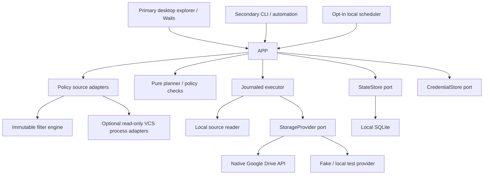

# 03 — Architecture

## Architectural baseline

Use a modular monolith, not microservices. One Go core supplies the **primary desktop explorer**, the secondary CLI, and the optional local scheduler. The first provider talks directly to Google Drive. Wails connects a TypeScript UI to Go application services; its documented Go/web architecture and platform support make it a candidate, not proof that packaging and native behavior are solved. P0 must verify target-OS packaging. [A01]



A desktop action and a CLI command must call the same use case. The GUI is the primary product surface; the CLI exists for automation, CI, remote/headless work, diagnostics, and reproducible tests. UI state never independently determines what files are transferred. The UI may request an operation, but the core revalidates authorization, paths, project configuration, and plan identity.

## Module boundaries

| Module | Responsibility | Must not own |
|---|---|---|
| `domain` | Typed IDs, entries, decisions, plans, state transitions | SDK clients, UI, filesystem I/O |
| `config` | Strict decoding, schema and semantic validation, migrations | Token storage, cloud mutation |
| `policy` | Typed policy-source descriptors, adapter registry, capability/version reports, immutable source snapshots | Selection semantics or cloud mutation |
| `policyadapters/*` | Read file/property/setting sources for Git, SVN, Mercurial, Perforce, CVS, Bazaar/Breezy, Fossil, and code tools | Arbitrary shell, repository mutation, credential import |
| `filters` | Dialect parsing, normalized rules, group evaluation, explain traces | Provider calls or arbitrary process execution |
| `discovery` | Safe local walk, rule snapshots, volume identity, candidate inventory | Remote deletion decisions |
| `planner` | Diff inventories and produce immutable operations | Executing those operations |
| `executor` | Apply authorized plan with journal, verification, cancellation | Inventing extra operations |
| `providers/drive` | Typed Google API access and capability reporting | Global selection policy |
| `providers/fake` | In-memory/local simulation and fault injection | Real credentials |
| `state` | Transactions, migrations, locks, run history, inventory | UI business logic |
| `credentials` | OS vault integration and secret references | Frontend access tokens |
| `scheduler` | Opt-in trigger calculation and deduplicated job requests | Weakening plan guards |
| `transport/cli` | Argument parsing, output, exit codes | Separate sync algorithm |
| `transport/desktop` | Wails binding and event DTOs | Raw OAuth secrets |
| `diagnostics` | Structured redacted logs, reports, metrics | Default telemetry |

Dependencies point toward domain/application ports. Avoid importing the entire rclone backend registry for one filtering helper. Package-global active filters or credentials are not allowed. A project invocation receives an immutable config snapshot, an immutable rule snapshot, a clock, a provider instance, and a scoped state transaction.

## Suggested implementation tree

```text
cmd/confirmar/             CLI composition root
cmd/confirmar-desktop/     desktop composition root
internal/domain/
internal/config/
internal/policy/
internal/policyadapters/git/
internal/policyadapters/svn/
internal/policyadapters/mercurial/
internal/policyadapters/perforce/
internal/policyadapters/cvs/
internal/policyadapters/bazaar/
internal/policyadapters/fossil/
internal/filters/gitignore/
internal/filters/rclone/
internal/filters/composition/
internal/discovery/
internal/planner/
internal/executor/
internal/providers/drive/
internal/providers/fake/
internal/state/sqlite/
internal/credentials/
internal/scheduler/
internal/transport/desktop/
internal/diagnostics/
frontend/                 TypeScript UI
migrations/               versioned SQL
schemas/                  serialized configuration and plan envelopes
examples/
tests/                    fixtures, integration, fault injection
```

The present package contains documentation and test data only; those proposed Go/frontend directories are created in P0/P1.

## Core ports

`LocalSource` supplies a root identity, inventory stream, non-following metadata lookup, bounded file open, and an identity/fingerprint recheck. It does not delete or rewrite source files in upload mode.

`StorageProvider` supplies account identity, capabilities, paginated child listing, object metadata by ID, create/upload, content read, and optional copy/history/trash operations. Each mutation includes an operation identity, a destination-root constraint, and any supported precondition. Optional operations return `CAPABILITY_UNSUPPORTED`, not a guessed fallback.

`PolicySourceAdapter` resolves an explicitly configured source mechanism into immutable policy material plus provenance and capability metadata. File-backed adapters read bounded files; metadata-backed adapters use a typed read-only mechanism. An adapter never mutates repository state. `svn` properties are obtained through a supported read-only SVN adapter (initially a fixed-argument `svn propget --xml` process adapter when available, or a later native binding); do not parse `.svn/wc.db` directly as a stable API.

`ProcessRunner` is an optional narrow port for approved read-only VCS metadata commands. It accepts an executable identity and fixed argument array, explicit cwd/root, timeout/cancellation, output limits, and sanitized environment. It never accepts a shell command string, hook, script, or user-generated executable path. A missing executable returns `CAPABILITY_UNSUPPORTED` for that adapter.

`RuleDialect` compiles a typed source group into an immutable evaluator. It returns a decision, rule provenance, an ancestor traversal decision, diagnostics, and conservative descendant-reachability information. It does not know OAuth or Drive file IDs.

`StateStore` records validated configuration revisions, run envelopes, inventories, operations, authorization, and verification outcomes transactionally. `CredentialStore` resolves opaque secret references only in the backend. `Clock`, `RandomSource`, and `NetworkPolicy` permit deterministic retry/scheduler tests.

## Domain objects

`ProjectId`, `AccountId`, `ProviderObjectId`, and `RunId` are distinct types, not interchangeable strings. `RelativePath` contains validated forward-slash-separated components. `Entry` distinguishes regular file, directory, symlink, native cloud document, shortcut, unsupported special node, and inaccessible node.

`RuleSnapshot` records group/source IDs, source content digests, directory context, parser version, discovery order, and required-source presence. `SelectionDecision` includes `include`, `exclude`, or `error`, group-level intermediate results, and an explanation. `Plan` binds immutable inventory IDs, source identity, destination identity, capabilities, configuration hash, rule hash, time, operations, risks, and authorization class.

`Run` and `Operation` use explicit state machines. Progress events carry run ID and sequence number; the UI can recover state from the store after dropping events. A success notification means all required operations were verified, not merely scheduled.

## Persistence and locking

Store runtime state outside synchronized source directories, in the OS application-data location. The project config may be checked into source control but contains no credentials. SQLite uses schema migrations, transactions, foreign-key constraints, and a documented journaling strategy. Keep the database on a supported local filesystem, not inside Drive/FUSE/network storage.

Persist projects/config revisions, account references, inventories, rule snapshots, plans, operations, baselines, recovery mappings, and run events. Keep upload-session tokens encrypted with a key protected by the credential store; they are not harmless URLs. Maintain bounded retention with explicit export and privacy controls.

Acquire a process-safe lock for a project's source/destination pair before running. Detect overlapping project destinations on the same machine. A local lock does not protect against another computer or Google Drive desktop; dedicated single-writer roots are the supported initial model.

## Planning and execution separation

Discovery produces complete inventories or an explicit incomplete result. Filtering determines selection without mutating either side. Planning operates on stable snapshots. Approval binds the exact plan digest and action classes. Execution revalidates preconditions and journals operations before performing them.

Remote reads during planning are allowed when an account is authorized; remote creates, folder creation, updates, trashing, and permission changes are not. A plan that needs a new folder contains a planned create operation rather than silently creating it during preview.

A file changing during transfer cannot produce a verified success. Re-read identity/size/modification information and verify the transferred digest; retry under a new bounded operation only after a fresh source snapshot. For very active files, pause and recommend a stable application-specific export rather than pretending to provide a filesystem snapshot.

## Performance design

Compile rule groups once per rule snapshot. Use lazy or indexed explain traces so a million-path scan does not store redundant full strings for every path. Cache only against path identity, relevant ancestor-rule digests, parser/composition version, and applicable metadata. Any rule change invalidates affected selections and plans.

Use bounded worker pools and bounded upload buffers. Stream data instead of loading full files. Build remote parent-ID indexes during paginated scans rather than issuing one full-tree search per file. Measure directory pruning under both conservative and ordered composition; optimization may not change results.

A watcher is only a hint source. Debounce and reconcile; overflow, sleep/wake, rename storms, lost events, or a rule edit trigger a new scan. There is no correctness dependency on receiving every filesystem event.

## Extension policy

Future providers implement the same capability contract and tests. Future dialects and policy-source adapters must define source mechanism, grammar, evaluation order, default result, scope/inheritance, errors, traversal, required external capabilities, and a compatibility oracle. The adapter registry is data-driven at configuration boundaries but compiled/allowlisted in the application; arbitrary runtime plugin loading remains out of scope. A filename preset is data, not an executable plugin. Arbitrary runtime plugin loading and user-supplied shell hooks are out of the first release.
